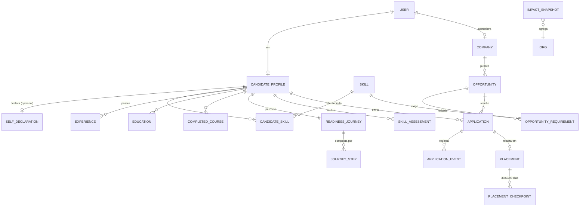

# Modelo de dados

Fonte da verdade: os schemas Zod em `src/features/*/model/`. As migrations em `supabase/migrations/`
espelham este documento. Divergência entre os dois é bug.

## 1. Diagrama de entidades



`ORG` acima é conceitual (a plataforma inteira); `IMPACT_SNAPSHOT` é uma tabela de agregados sem chave
estrangeira para dado pessoal — de propósito.

## 2. Entidades

**User** — `id`, `email`, `role: 'candidate' | 'company' | 'admin'`, `created_at`. Espelha `auth.users`
do Supabase; senha nunca vive aqui.

**CandidateProfile** — `user_id`, nome, telefone, `city`, `uf`, `education_level`, `availability`
(`immediate` | `30_days` | `negotiable`), `desired_areas: string[]`, `salary_expectation_min/max`,
`summary`, `resume_file_path` (só o caminho no Storage; sem parsing), `updated_at`.

**SelfDeclaration** — `candidate_id`, `groups: SelfDeclaredGroup[]`, `consent_given: boolean`,
`consented_at`. Tabela **separada** do perfil, e essa separação é intencional: permite negar leitura do
dado sensível em nível de linha sem mutilar o restante do perfil. Grupos: `black`, `indigenous`, `lgbtqia`,
`pwd`, `woman_vulnerable`, `low_income_youth`, `immigrant_refugee`. Multi-seleção, opcional, revogável.

**Skill** — `id`, `name`, `category` (`technical` | `behavioral` | `language` | `digital-literacy`).
Catálogo controlado; nada de texto livre, senão o matching morre.

**CandidateSkill** — `candidate_id`, `skill_id`, `self_level: 1..5`, `validated_level: 1..5 | null`,
`validated_at`. Nível efetivo = `validated_level ?? self_level`, com peso menor quando não validado.

**Experience / Education / CompletedCourse** — histórico do candidato, com período e descrição.
`CompletedCourse` guarda `opportunity_id` quando o curso veio da própria plataforma — é o que fecha o
ciclo gap → curso → nova pontuação.

**Company** — `legal_name`, `trade_name`, `cnpj`, `sector`, `size`, `city/uf`,
`approval_status: 'pending' | 'approved' | 'rejected'`, `diversity_commitments: string[]`, `about`.
Empresa não aprovada não publica.

**Opportunity** — `company_id`, `kind: 'job' | 'internship' | 'course' | 'workshop' | 'training-program'`,
`title`, `description`, `work_mode` (`onsite` | `hybrid` | `remote`), `city/uf`,
`salary_min/max`, `area`, `min_education_level`, `min_experience_years`, `is_affirmative`,
`affirmative_groups: SelfDeclaredGroup[]`, `deadline`, `status: 'draft' | 'pending_review' | 'published' | 'closed'`.
Cursos e workshops são oportunidades também — assim a trilha e a busca usam a mesma entidade, e um gap de
skill pode apontar direto para um curso publicado.

**OpportunityRequirement** — `opportunity_id`, `skill_id`, `min_level: 1..5`, `weight: 'required' | 'nice_to_have'`.

**Application** — `candidate_id`, `opportunity_id`, `status`, `match_score_snapshot`,
`match_explanation_snapshot`, `created_at`. O score é congelado no envio: a vaga muda, o histórico não.

**ApplicationEvent** — trilha de auditoria de cada transição: `from`, `to`, `actor_id`, `note`, `at`.

**ReadinessJourney / JourneyStep** — trilha do candidato e suas etapas, com `status`
(`locked` | `available` | `in_progress` | `done`) e `completed_at`.

**SkillAssessment** — `candidate_id`, `skill_id`, `score`, `resulting_level`, `taken_at`.

**Placement / PlacementCheckpoint** — contratação confirmada, com `initial_income`, `start_date`; e
checkpoints em 30/60/90 dias com `income`, `still_employed`, `satisfaction`, `notes`. É daqui que sai o
indicador de evolução de renda.

**ImpactSnapshot** — recorte agregado por período: cadastros, empresas parceiras, oportunidades,
encaminhamentos, contratações, renda média inicial e atual, distribuição por grupo autodeclarado, funil da
trilha. Só contagens; nenhum vínculo com pessoa identificável.

## 3. Máquina de estados — Application

```
rascunho ──► enviada ──► em_analise ──► entrevista ──► oferta ──► contratado
    │           │            │              │            │
    └─► (excluída)           └──────────────┴────────────┴──► nao_selecionado
```

Transições válidas declaradas em **um único objeto tipado** em `features/applications/model/`, com teste
para cada transição permitida e para as proibidas. Regras: `contratado` e `nao_selecionado` são terminais;
só `contratado` cria um `Placement`; toda transição grava um `ApplicationEvent`.

## 4. Máquina de estados — ReadinessJourney

```
cadastro → diagnostico → trilha_cursos → preparacao_entrevista
→ candidatura → processo_seletivo → contratacao → acompanhamento_90d
```

Cada etapa tem critério de conclusão objetivo (ex.: `diagnostico` conclui com ≥1 `SkillAssessment`).
A etapa seguinte é desbloqueada pela conclusão da anterior, mas **candidatar-se nunca é bloqueado** — a
trilha orienta, não aprisiona. Quando o candidato se candidata "fora de ordem", a trilha registra o pulo e
segue mostrando o que falta.

## 5. Privacidade e RLS

RLS habilitada em **todas** as tabelas. Sem política permissiva padrão; o default é negar.

| Tabela                     | Candidato                  | Empresa                                     | Admin                   |
| -------------------------- | -------------------------- | ------------------------------------------- | ----------------------- |
| `candidate_profile`        | leitura/escrita do próprio | leitura só de quem se candidatou à sua vaga | leitura                 |
| `self_declaration`         | leitura/escrita do próprio | **nenhum acesso, nunca**                    | somente agregado (view) |
| `candidate_skill`          | próprio                    | de quem se candidatou                       | leitura                 |
| `company`                  | leitura de aprovadas       | própria                                     | tudo                    |
| `opportunity`              | leitura de publicadas      | próprias                                    | tudo                    |
| `application`              | próprias                   | das próprias vagas                          | leitura                 |
| `placement` / `checkpoint` | próprios                   | nenhum                                      | leitura                 |
| `impact_snapshot`          | nenhum                     | nenhum                                      | leitura                 |

Ponto que sustenta a defesa na banca: **a empresa nunca lê autodeclaração**. Ela vê que a vaga afirmativa
foi atendida e vê a explicação do match; não vê o rótulo da pessoa. O filtro afirmativo é aplicado no
servidor, sobre dado que a empresa não pode consultar. Consentimento é explícito, datado e revogável —
revogar remove a linha e recalcula a ordenação, sem apagar candidaturas.
